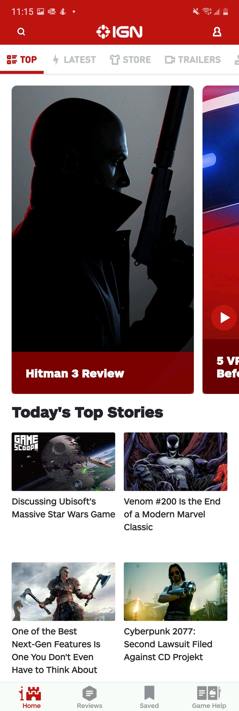
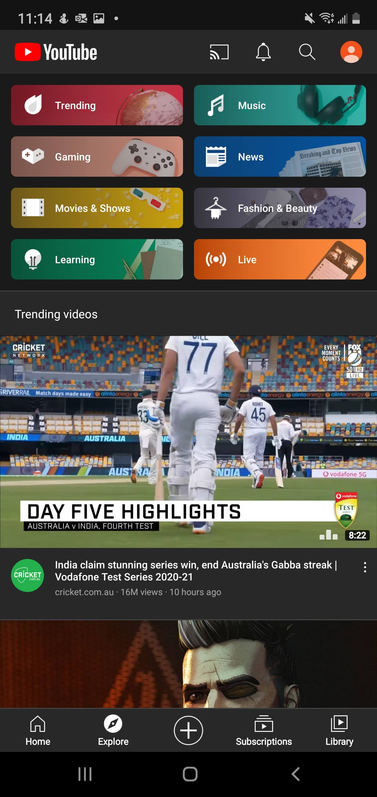
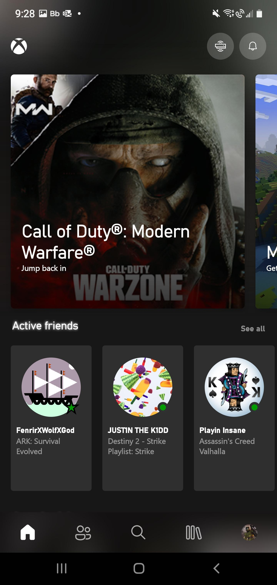

# DGL114 - Process Portfolio
## Author: Reeve Jarvis 
---
### **Week 1 Activities**
---
#### **Actitivity 0101:**

>**Question:** Find one example of a mobile app that has an interface that you consider 'good', and one example of a mobile app that has an interface that you consider 'poor' (or, if not poor, at least 'difficult'). Take some screenshots that highlight the best and worst of each app and provide a short description in your Process Portfolio justifying your choices.

I tend to only keep apps on my phone that I consider to be "good". If an app causes me more frustration then I deem acceptable I usually will delete it shortly after downloading. Saying that, there are always negative aspects to every app.

|Poor App: IGN|
|---|
|| 

One app that I have had some significant trouble with is the IGN app (shown below). This application has been updated quite regularily since I began using it, which at least shows a commitment to providing a better user experience. However, overall I would consider this app "poor" in terms of interface.

One thing that I find frustrating with the apps interface is their inconsistent use of laypout/interaction methods. Switching between vertically stacked articles, horizontal scrolling sections, and then thumbnails laid out in a grid format make the experience harder then it needs to be. Aditionally the navigation menu at the top is not presented in a way that you can browse the options without horizontal scrolling. Personally I beleive that you should stick to one method of interaction in your design (at least on a per-page basis) to provide a consistent experience. I find horizontal scrolling to be less attractive, and a hinderence to the apps usability overall.

Looking past the negatives stated above, there are still some positive aspects of the interface. The app provides multiple ways to filter which content you would like to view based on popularity, genre etc. It also allows you to track the articles you are interested in by providing a way to save them for later. Additionally there is the option to search for specific content (though this search function does not work the best).

|Good App: YouTube|
|---|
||

YouTube is an app that I would consider "good". I use YouTube regularily, it is how I get my news, and updates on my hobbies and interests. It has come a long way since the original app on the iPhone all those years ago, though it is not without its faults.

Being one of the first apps developed for smartphones, YouTube has had the time needed to perfect its interface. It provides a consistent layout (disregarding the "stories" section that EVERY app seems to insist on having these days) which makes the user experience super easy and straightforward. The videos are laid out in a vertical scrolling format, allowing you to browse with ease. It even allows you to minimize your video to continue scrolling as you watch. The explore tab (shown below) gives you a well presented navigation menu to select from different genres and shows you trending videos. Additionally it gives you easy ways to produce content for your channel, and stream to other devices. 

Depending on your device and the amount of subscriptions you have, the interface can become a bit cluttered, but overall I would rate the YouTube app as "good".

---

### **Activity 0102:**

>**Question:** Consider what it means for a mobile interface to be 'usable'. What types of things do you expect to find in an app that is considered 'intuitive'? Make a list of as many 'usable' and 'intuitive' elements as you can think of (Hint: Don't restrict yourself only to buttons and widgets!)

In a world filled with smartphones/smart devices we have grown to expect a certain level of intuitive design in our products. People end up being the judge and jury on whether an app is "good" or "bad". In order for an app to be considered intuitive or usable I feel it should take the following into consideration:

* Provide the shortest route possible to get to the content we want
* As little scrolling as possible for the main content
* Be responsive to the the various ways we view the content, whether that be portrait/landscape or phone/tablet etc.
* Give a simplified navigation menu, with access on every page
* Provide up to date content regularily without the need for constant refreshing
* Integrate with out current applications including those proprietary to our device
* Auto fill data needed for forms etc.
* Ensuring buttons and actions operate as intended (dead links suck)

---
### **Week 2 Activities**
---

#### **Activity 0202**

>**Question:** Choose a mobile app (Android or iOS) that you use frequently. Pick one screen in the app and identify elements of the Model, View and Controller in that screen. In other words, list out all View elements (i.e. everything you can see on screen), all Model elements (i.e. all data relevant to that screen) and all Controller elements (i.e. all the possible interactions on that screen that may modify the Model or View).

|Xbox|
|---|
||

Keeping with my passion for video games, the app I have chosen to discuss is the Xbox app. I use this application frequently to assist in communicating with my friends on xbox, and keep track of my captures and achievements on the platform.

The screen displayed above is the home screen of the application. It provides details regarding my notifications, recently played games, and currently active friends. Additionally, it gives the option to connect with your console over your network to initiate game streaming. This page requires a significant amount of data to be passed from the model to the controller, in order to display the view. 

Model Components:

* Recently played game data, with the option to initiate streaming to your phone
* Data on notification messages
* Data regarding your friends-list and active friends currently playing on the platform
* Your friends current status(Whether it be online, busy, etc.)
* Data indicating friendship designation (favourite or not)
* What games your friends are currently playing
* Data required to navigate to additional screens

View:

* The branding identity (logo in the top corner)
* Icons indicating streaming and notifications up in the right corner
* Game boxart and titles displayed in your recently played games
* Heading string indicating the Active Friends section, and option to see more
* Friends Gamertags, and profile pictures
* Names of games that friends are playing 
* Icons along the bottom forming the navigation menu to additional pages

Controller:

* Gathering data from the model concerning notifications when icon is tapped
* Communicating with your console upon hitting the streaming icon
* Displaying data from the model on game information, and content upon selecting a recently played game
* Presenting Friends information when interacting with Active friends section
* Navagating to different pages when interacting with the icon navigation menu at the bottom

---

#### **Activity 0203**

>**Question:** Visit material.io and examine some aspects of Material Design. Scroll through the site and take a look at one page/article that interests you in more detail. Summarize what you learn from the article in your Process Portfolio.

Browsing material.io provided me with some insight into some of the design concepts to consider when creating an attractive and usable UI. While exploring the information I came across an article regarding the importance of Shape in your designs, and decided to investigate further.

The article discussed the many different ways that shape contributes to a design. It is easy to overlook just how important the proper use of shape can be. Shape can be used to direct attention, identify certain components, comunicate the state of different elements, and express a brand identity. By creating emphasis on certain elements on the screen, you can help guide the users attention to the important details. Additionally, shape can be used to categorize/organize the contents of the screen and maintain a certain level of usability. When working with interactive elements, you can also use shape to communicate the state of the object, such as when you are toggling options or selecting something on the screen. And finally, the use of shape can communicate the personality of a product which contributes to the brand identity and establishes a recognizable product.

I found it very interesting to explore these ideas further, and it helped me gain a greater appreciation for the importance of every little detail working together to create an interface that is both attractive and productive. 

