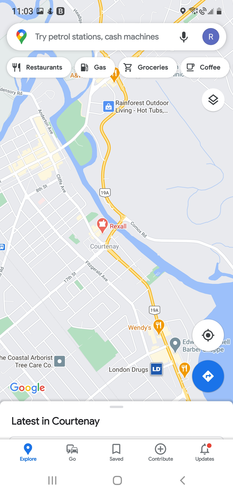
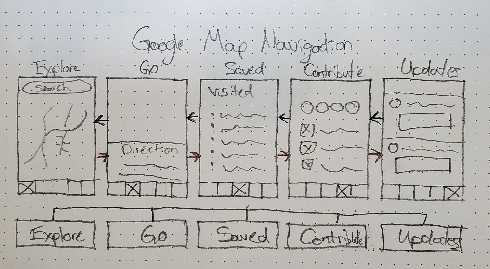

# DGL114 - Process Portfolio

## Author: Reeve Jarvis

 

---

## **Part 1:**

---

### **Week 1 Activities**

---

 

#### **Actitivity 0101:**

 

> **Question:** Find one example of a mobile app that has an interface that you consider 'good', and one example of a mobile app that has an interface that you consider 'poor' (or, if not poor, at least 'difficult'). Take some screenshots that highlight the best and worst of each app and provide a short description in your Process Portfolio justifying your choices.

 

I tend to only keep apps on my phone that I consider to be "good". If an app causes me more frustration then I deem acceptable I usually will delete it shortly after downloading. Saying that, there are always negative aspects to every app.

| Poor App: IGN                     |
| --------------------------------- |
|  |

One app that I have had some significant trouble with is the IGN app (shown above). This application has been updated quite regularily since I began using it, which at least shows a commitment to providing a better user experience. However, overall I would consider this app "poor" in terms of interface.

One thing that I find frustrating with the apps interface is their inconsistent use of laypout/interaction methods. Switching between vertically stacked articles, horizontal scrolling sections, and then thumbnails laid out in a grid format make the experience harder then it needs to be. Aditionally the navigation menu at the top is not presented in a way that you can browse the options without horizontal scrolling. Personally I beleive that you should stick to one method of interaction in your design (at least on a per-page basis) to provide a consistent experience. I find horizontal scrolling to be less attractive, and a hinderence to the apps usability overall.

Looking past the negatives stated above, there are still some positive aspects of the interface. The app provides multiple ways to filter which content you would like to view based on popularity, genre etc. It also allows you to track the articles you are interested in by providing a way to save them for later. Additionally there is the option to search for specific content (though this search function does not work the best).

 

| Good App: YouTube                         |
| ----------------------------------------- |
|  |

 

YouTube is an app that I would consider "good". I use YouTube regularily, it is how I get my news, and updates on my hobbies and interests. It has come a long way since the original app on the iPhone all those years ago, though it is not without its faults.

Being one of the first apps developed for smartphones, YouTube has had the time needed to perfect its interface. It provides a consistent layout (disregarding the "stories" section that EVERY app seems to insist on having these days) which makes the user experience super easy and straightforward. The videos are laid out in a vertical scrolling format, allowing you to browse with ease. It even allows you to minimize your video to continue scrolling as you watch. The explore tab (shown above) gives you a well presented navigation menu to select from different genres and shows you trending videos. Additionally it gives you easy ways to produce content for your channel, and stream to other devices.

Depending on your device and the amount of subscriptions you have, the interface can become a bit cluttered, but overall I would rate the YouTube app as "good".

---

 

#### **Activity 0102:**

 

> **Question:** Consider what it means for a mobile interface to be 'usable'. What types of things do you expect to find in an app that is considered 'intuitive'? Make a list of as many 'usable' and 'intuitive' elements as you can think of (Hint: Don't restrict yourself only to buttons and widgets!)

In a world filled with smartphones/smart devices we have grown to expect a certain level of intuitive design in our products. People end up being the judge and jury on whether an app is "good" or "bad". In order for an app to be considered intuitive or usable I feel it should take the following into consideration:

- Provide the shortest route possible to get to the content we want
- As little scrolling as possible for the main content
- Be responsive to the the various ways we view the content, whether that be portrait/landscape or phone/tablet etc.
- Give a simplified navigation menu, with access on every page
- Provide up to date content regularily without the need for constant refreshing
- Integrate with out current applications including those proprietary to our device
- Auto fill data needed for forms etc.
- Ensuring buttons and actions operate as intended (dead links suck)

 

---

### **Week 2 Activities**

---

 

#### **Activity 0202:**

 

> **Question:** Choose a mobile app (Android or iOS) that you use frequently. Pick one screen in the app and identify elements of the Model, View and Controller in that screen. In other words, list out all View elements (i.e. everything you can see on screen), all Model elements (i.e. all data relevant to that screen) and all Controller elements (i.e. all the possible interactions on that screen that may modify the Model or View).

 

| Xbox                         |
| ---------------------------- |
|  |

 

Keeping with my passion for video games, the app I have chosen to discuss is the Xbox app. I use this application frequently to assist in communicating with my friends on xbox, and keep track of my captures and achievements on the platform.

The screen displayed above is the home screen of the application. It provides details regarding my notifications, recently played games, and currently active friends. Additionally, it gives the option to connect with your console over your network to initiate game streaming. This page requires a significant amount of data to be passed from the model to the controller, in order to display the view.

Model Components:

- Recently played game data, with the option to initiate streaming to your phone
- Data on notification messages
- Data regarding your friends-list and active friends currently playing on the platform
- Your friends current status(Whether it be online, busy, etc.)
- Data indicating friendship designation (favourite or not)
- What games your friends are currently playing
- Data required to navigate to additional screens

View:

- The branding identity (logo in the top corner)
- Icons indicating streaming and notifications up in the right corner
- Game boxart and titles displayed in your recently played games
- Heading string indicating the Active Friends section, and option to see more
- Friends Gamertags, and profile pictures
- Names of games that friends are playing
- Icons along the bottom forming the navigation menu to additional pages

Controller:

- Gathering data from the model concerning notifications when icon is tapped
- Communicating with your console upon hitting the streaming icon
- Displaying data from the model on game information, and content upon selecting a recently played game
- Presenting Friends information when interacting with Active friends section
- Navagating to different pages when interacting with the icon navigation menu at the bottom

---

 

#### **Activity 0203**

 

> **Question:** Visit material.io and examine some aspects of Material Design. Scroll through the site and take a look at one page/article that interests you in more detail. Summarize what you learn from the article in your Process Portfolio.

 

Browsing material.io provided me with some insight into some of the design concepts to consider when creating an attractive and usable UI. While exploring the information I came across an article regarding the importance of Shape in your designs, and decided to investigate further.

The article discussed the many different ways that shape contributes to a design. It is easy to overlook just how important the proper use of shape can be. Shape can be used to direct attention, identify certain components, comunicate the state of different elements, and express a brand identity. By creating emphasis on certain elements on the screen, you can help guide the users attention to the important details. Additionally, shape can be used to categorize/organize the contents of the screen and maintain a certain level of usability. When working with interactive elements, you can also use shape to communicate the state of the object, such as when you are toggling options or selecting something on the screen. And finally, the use of shape can communicate the personality of a product which contributes to the brand identity and establishes a recognizable product.

I found it very interesting to explore these ideas further, and it helped me gain a greater appreciation for the importance of every little detail working together to create an interface that is both attractive and productive.

 

---

### **Week 3 Activities**

---

 

#### **Activity 0301**

 

> **Question:** Choose a mobile app (Android or iOS) that you use frequently. Do your best to identify all the activities (or 'screens') in the app and write them down in your Process Portfolio. See if you can come up with some meaningful way to categorize all screens. (Note that some screens in some apps may have tabs and menus, etc. I'm looking here just for the screens themselves - so any time there is a clear full screen change in the app. Additionally, note that in iOS we do not refer to these as 'activities', but more commonly as 'views'. For the purposes of this activity the distinction is not too important).

 

**App in Focus:** IGN

Browsing through the IGN app, I have identified the following activities...

**Activities:**

- Home - The initial screen presented upon launching the app (Though you can change which screen to display in your settings)

- Reviews - A screen dedicated to content regarding tech/media reviews.

- Saved - A screen with content you have marked/saved for later viewing

- Game Help - A screen dedicated to game help wikis

- Search - A screen displayed when interacting with the search function

- Profile/Settings - Your profile/account information as well as application settings

One way that I might be able to categorize these activities is by their use cases/purpose such as Administrative, content, and Interactive elements.

| Administrative | Content   | Interactive |
| -------------- | --------- | ----------- |
| Profile        | Home      | Search      |
|                | Reviews   | Saved       |
|                | Game Help |             |

 

Or purhaps in simpler terms of Individual vs. Global information as some screens apply to only the user, and others are constant amongst all users.

| Global    | Individual |
| --------- | ---------- |
| Home      | Profile    |
| Reviews   | Saved      |
| Game Help | Search     |

---

 

#### **Activity 0302**

 

> **Question:** Choose a mobile app (Android or iOS) that you use frequently and consider some of the more common Android event types are discussed in chapter 3.1 of the textbook. Which of these events does your app use? List a few different instances for each event in your app. Can you think of other events that your app might use that are not discussed in chapter 3.1?

 

**App in Focus:** IGN

When inspecting the IGN app for event types we discussed in this chapter of the book I was only able to identify two of note. The onClick(), and onTouch() events. The aplications user interface is quite basic and only really responds to either clicking on links/buttons/images, or touching and swiping through certain levels of content.

**Examples of onClick():**

- Clicking on an article to open it
- Clicking the save button icon to add to your saved activity
- Clicking setting buttons to adjust their values
- Clicking the search to perform a search through the content
- Clicking on navigation menu items to browse other activities

**Examples of onTouch():**

- Performing slide gestures to navigate through activity screens
- Performing slide gestures to navigate through horizontal scrolling areas
- Performing slide gestures to scroll through the content of each activity screen

**Alternative System Events:**

- There is the option to adjust your location preference in the settings which could trigger a system event with location services maybe?

 

---

### **Week 4 Activities**

---

 

#### **Activity 0401**

> **Question:** Choose a mobile app (Android or iOS) that you use frequently. Characterize the app's navigational model by examining how the user traverses through different activities (i.e. 'screens') in the app. Is the navigational model flat? (Meaning all activities have the same level of importance, perhaps each activity is accessible by swiping left or right?) Is there a hierarchical relationship between activities? (Meaning, is there a central, or main screen from which all other activities are accessed?) Discuss your findings in your Process Portfolio.

 

**App in Focus:** Google Maps

| Google Maps                           |
| ------------------------------------- |
|  |

I use google maps daily to plan the fastest routes when travelling, or going on a bike ride. Upon inspecting the application, I would clasify the navigational model as flat. Each activity has the same level of importance. The map screen is the initital activity launched when opening the app, though it holds no hierarchical dominance over the alternate activities. All activity screens accessible within the app can be opened using the navigation menu along the bottom of the screen. There are no hierarchical relationships as navigation is freely handled through this menu.

---

 

#### **Activity 0403**

> **Question:** After reading chapter 4.5 - App Bar visit material.io and read the article App bars: Bottom. After reading the article summarize the differences between the use of top and bottom app bars in your Process Portfolio.

 

Browsing the material.io article regarding app bars, I learned alot about their proper implementation and certain things to avoid.

Bottom Bars:

- Only use if the app doesnt have a bottom navigation menu
- Should only be used on screens with two to five actions
- Should disappear/appear during scrolling
- Should be overlaped with on screen elements such as the keyboard
- Should not contain navigation
- Overlapping or inset FAB

Top Bars:

- Pair with bottom bars to create a good range of options
- Maintain consistent search location
- Contain overflow menu with additional options
- Destructive operations such as delete

---

### **Week 5 Activities**

---

 

#### **Activity 0501**

> **Question:** Choose a mobile app (Android or iOS) that you use frequently. For this activity you will characterize the app's navigational model (similar to activity 0401), but in this case you will draw a diagrammatic representation of the navigation. You may use the same app chosen for activity 0401. Include an image of your drawing in your Process Portfolio and briefly describe what you have learned from this activity.

As shown in the above diagram, the navigation model of the Google Maps app is a flat navigation structure. There is no dominant hierarchy and each activity screen has the same level of importance. The nav bar is directly accessible along the bottom of each activity screen and you can traverse through them all from whichever screen you are on.

---

 

#### **Activity 0503**

> **Question:** After reading chapter 5.3 -Dialogs visit material.ioand read the articleDialogs. As you read carefully consider when the use of dialogs is appropriate. Summarize your findings in your Process Portfolio.

After reading chapter 5.3, and browing the dialogs article on material.io I have learned some useful information pertaining to the use of dialogs. Dialogs are alert windows that are produced as a result of some event taking place such as a new activity produced or interaction taking place. They relay important information, and even sometimes prompt for user input. These are used as messengers to inform users of changes or information, and must be dismissed before continuing.

The only time you should use dialogs is:

- When a critical error occurs that halts normal program execution
- To display important information to the user that either requires acknowledgement or some other form of decision/task

Due to their disruptive behaviour you should always use Dialogs sparingly, and only in moments of need. Using dialogs too frequently can cause your app to become much less desireable to its users. Additionally you should always ensure to provide a clear presentation of what actions the user can take with the dialog, whether it be dismissive, confirmation, or just informative.

---

## **Part 2:**

---

### **Week 8 Activities**

---

 

#### **Actitivity 0802:**

 

> **Question:** To-Do List uses app-specific storage to store a text file made up of all to-do list items. Now imagine a more 'advanced' version of To-Do List and using the data storage strategies presented in section 6.1 as a guide, list other types of data that the 'advanced' To-Do List might store. Make sure to identify at least one type of data per strategy.

An advanced To Do List app could make use of the following data storing strategies to improve the functionality of the app:

- Shared Preferences - Perhaps there could be stored preferences for the user regarding visual presentation (themes, colours, fonts, bullet styles).
- App-specific files - Maybe the To DO List app uses profiles and stores the app specific profile to the internal storage, including avatar photos etc.
- Shared storage - Maybe the To Do List app can store images of the lists that can in turn be used within other apps such as your calendar or email app.
- Database - Use a database to track the date that a list was entered and store it in a database organized in order for later viewing.
- Cloud - You could mark your notes for update into the cloud to be shared across different devices, or make certain lists private and accessible through your profile

---

 

#### **Actitivity 0803:**

 

> **Question:** After reading chapter 6 visit material.io and read the article Lists. Consider the list in the To-Do List app. Does it meet the expectations of Material Design? Summarize your findings on your process portfolio.

When considering the To Do List app, after reading the Material.io article, I can definitely identify some room for improvement. The current layout of the to do list does not have much in terms of organization and separation of data. The list items could definitely be separated better, and have some more dividing lines. This is particularly a problem when it comes to multi-lined list items. Additionally, I feel like it could benefit from further information being added. One other thing I'd like to point out is the visual presentation of the list items. There is a lack of hierarchy in the list items between their indicating number and the text content itself.

---

### **Week 9 Activities**

---

 

#### **Actitivity 0901:**

 

> **Question:** After reading section 7.2 in the text (and implementing all related code) take a read through the article Save data in a local database using Room on Android Developers. Based on your understanding developed in the textbook and from the Android Developers article, write a paragraph or two on your process portfolio summarizing your understanding of Room, its main components and how they relate to one another.

Room is used to simplify the implementation of SQLite and the use of relational databases within your application. It allows you to set up a database, and by using annotations create methods to interact with the database just as you would in SQL statements for queries such as SELECT, INSERT, UPDATE and DELETE. It greatly reduces the code required to implement this strategy. Room uses three main components:

- Database Class - This class holds the database itself, and provides access to it. It serves as the connection to the persistent data within your database.
- Data Entities - These represent the tables within your relational database.
- DOA (Data Access Objects) - These object provide methods to access the database using SQL queries such as SELECT, INSERT, UPDATE, DELETE.

Within your Data Entities, each instance represents a new row within the table. You can use annotations to designate the column names and set primary keys as necessary. Within the DOA interface, you can declare the methods required to access the entity data within your tables using SQL logic. @QUERY Annotations require the declaration of SELECT statements while others such as @INSERT, or @DELETE do not. And finally within your Database Class you define the configuration of your database and list the entities that it pertains to.

---

 

#### **Actitivity 0903:**

 

> **Question:** Visit material.io and read the article Cards (make sure you have the Design tab - and not the Implementation tab - selected). Consider the cards used in the Study Helper app: How could they be improved, based on the recommendations in the Cards article? Summarize your thoughts on your process portfolio.

After reading the article regarding Cards, and reviewing the current implementation within the Study Helper App I do see room for improvement. Saying that, for this simple app and its particular use, I'm not sure that more intricate cards are entirely necessary. They simply need to display a general topic of study and do not need anything fancy to serve their purpose. However, if I were to adjust them I would:

- Add icons and other design elements regarding the theme of the subject to increase the overall appearance and attractiveness
- Perhaps the cards could have an additional action button that could designate the difficulty level of the questions within
- Add a favourites button to add the subject card to your favourite selection

Overall some minor design changes could increase their individuality and provide a more aesthetic experience, though I do not feel it necessary.

---

### **Week 10 Activities**

---

 

#### **Actitivity 1001:**

 

> **Question:** After reading sections 8.1 and 8.2 consider the types of tasks in an app that would necessarily be asynchronous (this may also require considering a particular type of app). Create a list of at least 10 asynchronous tasks that you might typically expect to see in a wide variety of apps - do some research if necessary. Write your list and summarize your findings on your process portfolio.

AsyncTask can be implemented to free up the main thread from long running tasks. This helps reduce any negative effects occuring on the UI presentation such as slowed responsiveness or view updates, and keeps things appearing consistently. There are many different tasks within an app that you could expect to use this approach such as:

- Downloading small files - downloading on the main thread can cause normal execution to come to a full stop until complete
- Uploading small files - similarly to downloading, uploading files on the main thread can slow things down until completion
- Gathering data - accessing data from a database to display and use
- Complex Calculations - performing long-running calculations
- Location updates - updating location to be used in map applications
- Timing - updating clocks/timers
- Newsfeed Updates - gathering social media newsfeed information and updating with most recent posts
- Message sending/receiving - sending messages while performing other tasks
- Tracking scores - calculating and tracking running scores for games/etc
- Browser background processes - performing background processes in a browser

---

 

#### **Actitivity 1003:**

 

> **Question:** Visit material.io and read the article Android notifications (focus on the first three sections: Usage, Anatomy of a notification and Behavior). Summarize the most important practices and considerations relating to notifications on your process portfolio.

When it comes to presenting Android Notifications, there are many things to consider:

**Usages** - the different use cases have grown over the years and notifications can be presented in many ways

- Status Bar/Notification Drawer - these are display as icons within the top status bar on the screen, and can be fully accessed by pulling down from the top of the screen to display the notification Drawer. From inside you can click to open the app that produced the notification or slide to remove it.
- Heads Up - these are displayed as temporary pop-ups on the screen while unlocked, and are typically used for important notifications that the user should see immediately.
- Lock Screen - these are displayed while your phone is locked and their level of complexity can be set by the user to hide information while locked or display them freely.
- App Icon Badge - these are shown on the app icon itself to indicate there is a notification. Users can access more details with a long-press.
- Wearables - notifcations can be mirrored to new wearable devices (smartwatches).

**Anatomy** - The anatomy of notifications is largely determined by the system templates of the device, the app only determines the contents. Typical anatomy includes:

- Small icon - A small icon reflecting the app that presented it
- App Name - The name of the app producing the notification
- Time Stamp - The time it was registered
  Optional:
- Large Icon - Typically only used for contact photos
- Title - Can be used to display who sent you a message etc.
- Text - Can show a preview of message contents

**Behaviour** - Typically, tapping a notification is expected to open the app that produced it. There is also the option to add additional behaviour such as:

- Action Buttons - For example replying to a text notification, or archiving an email
- Expandability - Expanding a notification to view the entire details such as the full message you received
- Updated in Place - Rather than sending multiple notifications you can update the one already present
- Grouping - multiple notifications can be grouped together if from the same application

Additionally user preferences can be used to establish notification importance levels on an app by app basis, as well as initiate a do not disturb state where no notifications are produced until after a designated time or the user turns this off.

---

### **Week 11 Activities**

---

 

#### **Actitivity 1101:**

 

> **Question:**

---

 

#### **Actitivity 1102:**

 

> **Question:**
